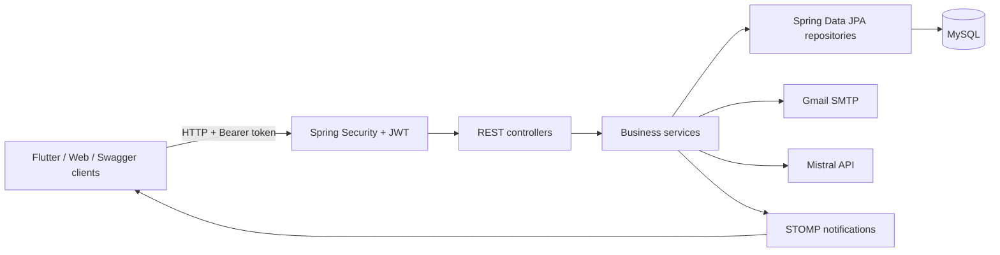
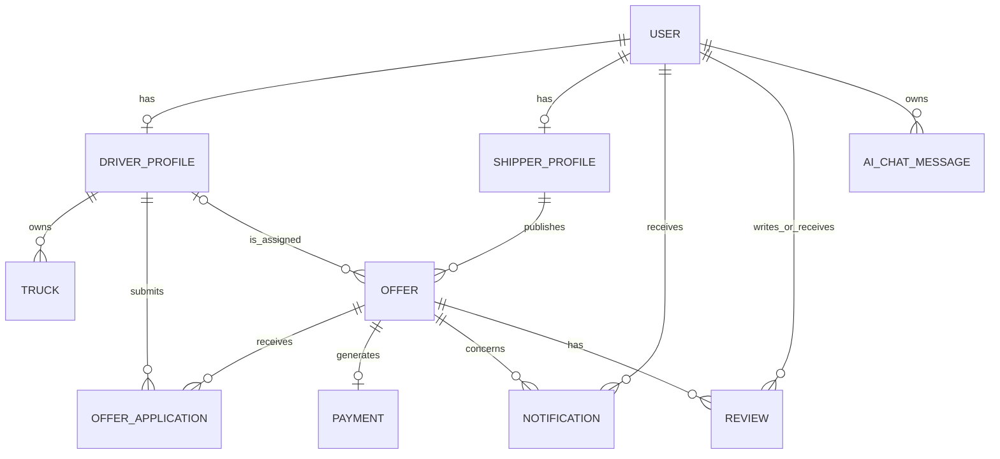

# BrikoulBack

BrikoulBack is the Spring Boot backend for **E-Samsar**, a transport marketplace that connects shippers who need to move goods with drivers who own suitable vehicles.

The backend manages the complete marketplace workflow: account registration and email verification, driver and shipper profiles, trucks, transport offers, driver matching, applications, real-time notifications, offer completion, payment records, reviews, AI-assisted search, and administration.

> **Naming:** `BrikoulBack` is the Maven artifact and backend application name. The product-facing name used by the mobile app, emails, and parts of the API is **E-Samsar**. In other words, BrikoulBack is the server-side component of the E-Samsar platform.

## Main features

- JWT authentication with `SHIPPER`, `DRIVER`, `ADMIN`, and `SUPER_ADMIN` roles
- Email verification and password reset using six-digit codes
- Separate shipper and driver profiles
- Driver truck and availability management
- Transport offer creation, search, assignment, tracking, and completion
- Automatic driver matching by location, vehicle type, load capacity, rating, and completed jobs
- Driver applications and shipper acceptance/rejection workflows
- Persistent and real-time STOMP/SockJS notifications
- Automatic payment records and platform-fee calculation when an offer is completed
- Two-way reviews between the shipper and assigned driver
- Mistral AI-assisted natural-language search with a local fallback extractor
- WhatsApp contact-link generation
- Admin statistics, moderation, account management, and super-admin management of admins
- OpenAPI documentation through Swagger UI
- A Flutter client in `e_samsar_mobile/`

## Backend architecture



The backend follows a conventional layered design:

- **Controllers** expose the REST API and validate request DTOs.
- **Services** enforce ownership, role, status-transition, and marketplace rules.
- **Repositories** use Spring Data JPA to query MySQL.
- **Mappers** convert JPA entities into request-safe response DTOs.
- **Security** validates JWTs for both HTTP and WebSocket connections.
- **Exception handling** returns a consistent JSON error structure.

## Technology stack

| Area | Technology |
| --- | --- |
| Runtime | Java 17 |
| Framework | Spring Boot 3.3.5 |
| REST | Spring Web |
| Persistence | Spring Data JPA, Hibernate, MySQL |
| Security | Spring Security, BCrypt, JJWT 0.12.6 |
| Validation | Jakarta Bean Validation |
| Real-time messaging | Spring WebSocket, STOMP, SockJS |
| Email | Spring Mail with Gmail SMTP |
| API documentation | springdoc-openapi / Swagger UI |
| AI integration | Mistral Chat Completions API |
| Build | Maven |
| Mobile client | Flutter / Dart |

## Repository structure

```text
.
├── pom.xml
├── src/main/java/com/esemsar/backend/
│   ├── ai/                 # Mistral prompts, parsing, and AI chat implementation
│   ├── config/             # Security, WebSocket, OpenAPI, schema, and seed configuration
│   ├── controllers/        # REST endpoints
│   ├── dtos/               # Request and response contracts
│   ├── entities/           # JPA entities
│   ├── enums/              # Roles and domain statuses/types
│   ├── exceptions/         # Domain exceptions and global error handling
│   ├── mappers/            # Entity-to-response mapping
│   ├── repositories/       # Spring Data repositories
│   ├── security/           # JWT filter and authenticated principal
│   ├── services/           # Service interfaces and implementations
│   └── websocket/          # WebSocket authentication and notification payloads
├── src/main/resources/application.properties
├── e_samsar_mobile/        # Flutter client
├── mobileappDesign/        # UI design references
└── orderOf testing end points.md
```

## Domain model

The central entities are:

- `User`: identity, credentials, role, account state, and contact information.
- `DriverProfile`: location, availability, rating, completed jobs, trucks, and applications.
- `ShipperProfile`: company details, rating, completed offers, and owned offers.
- `Truck`: vehicle type, capacity, registration plate, image, and active state.
- `Offer`: shipment route, goods, weight, required vehicle, price, date, status, owner, and assigned driver.
- `OfferApplication`: a driver's message, proposed price, and application status.
- `Notification`: stored notification associated with a recipient and optionally an offer.
- `Payment`: amount, platform fee, method, status, and completed offer.
- `Review`: rating and comment between users involved in a completed offer.
- `EmailVerificationToken` and `PasswordResetToken`: expiring one-time codes.
- `AiChatMessage`: stored AI search request and extracted filters.



## Marketplace workflow

1. A shipper or driver self-registers. Admin roles cannot self-register.
2. The account starts disabled and is enabled after email verification.
3. A driver completes a profile, adds at least one truck, and becomes available.
4. A shipper creates an offer. The backend immediately finds compatible drivers and notifies the best matches.
5. Drivers apply with an optional message and proposed price.
6. The shipper accepts one application. The offer becomes `ASSIGNED`, and remaining pending applications are rejected.
7. The shipper or assigned driver starts the job, moving it to `IN_PROGRESS`.
8. The shipper or an administrator completes it. The backend increments completion counters, creates a paid cash-payment record, calculates the platform fee, and notifies the driver.
9. The assigned driver and shipper can review each other once the offer is completed.

The intended offer lifecycle is:

```text
PENDING -> NOTIFIED -> ASSIGNED -> IN_PROGRESS -> COMPLETED
    \          \          \             \
     +----------+----------+---------------> CANCELED
```

Application statuses are `PENDING`, `ACCEPTED`, `REJECTED`, and `CANCELED`.

### Driver matching

A driver is eligible when the driver is available and has an active truck with the exact required vehicle type and sufficient capacity. Eligible drivers are ranked using:

- departure-city match: up to 50 points;
- how closely the truck capacity fits the load: up to 25 points;
- average rating: rating multiplied by 10;
- experience: completed jobs, capped at 100, multiplied by 0.5.

The offer's `maxDriversToNotify` controls the result limit and defaults to 10.

## Prerequisites

- JDK 17
- Maven 3.8 or newer
- MySQL 8.x or a compatible MySQL server
- Gmail SMTP credentials for real email delivery
- A Mistral API key for AI-backed filter extraction

The Maven wrapper and Docker Compose are not included, so `java`, `mvn`, and MySQL must be available locally.

## Configuration

The application reads the following environment variables:

| Variable | Required by the current configuration | Purpose |
| --- | --- | --- |
| `DB_URL` | No | JDBC URL; defaults to local `esemsar_db` with automatic database creation enabled |
| `DB_USERNAME` | No | Database user; defaults to `root` |
| `DB_PASSWORD` | Yes | Database password |
| `JWT_SECRET` | Strongly recommended | HMAC signing secret; replace the development default with a long random value |
| `MAIL_USERNAME` | Yes | Gmail/SMTP username |
| `MAIL_PASSWORD` | Yes | Gmail app password |
| `MISTRAL_API_KEY` | Yes | Mistral API key |
| `APP_EMAIL_VERIFICATION_URL` | No | Verification-link template; must contain `{token}` |

For local development without working email or Mistral credentials, the required placeholders can be defined as empty values. The app will still start; email send failures are logged while their codes remain valid, and AI chat falls back to local French/English keyword extraction when Mistral is unavailable.

### Linux/macOS example

```bash
export DB_URL='jdbc:mysql://localhost:3306/esemsar_db?createDatabaseIfNotExist=true&useSSL=false&allowPublicKeyRetrieval=true&serverTimezone=UTC'
export DB_USERNAME='root'
export DB_PASSWORD='your_mysql_password'
export JWT_SECRET='replace-with-a-random-secret-of-at-least-32-bytes'
export MAIL_USERNAME='your_email@gmail.com'
export MAIL_PASSWORD='your_gmail_app_password'
export MISTRAL_API_KEY='your_mistral_api_key'
```

### PowerShell example

```powershell
$env:DB_URL="jdbc:mysql://localhost:3306/esemsar_db?createDatabaseIfNotExist=true&useSSL=false&allowPublicKeyRetrieval=true&serverTimezone=UTC"
$env:DB_USERNAME="root"
$env:DB_PASSWORD="your_mysql_password"
$env:JWT_SECRET="replace-with-a-random-secret-of-at-least-32-bytes"
$env:MAIL_USERNAME="your_email@gmail.com"
$env:MAIL_PASSWORD="your_gmail_app_password"
$env:MISTRAL_API_KEY="your_mistral_api_key"
```

If the database user cannot create databases, create it manually:

```sql
CREATE DATABASE esemsar_db CHARACTER SET utf8mb4 COLLATE utf8mb4_unicode_ci;
```

## Run the backend

From the repository root:

```bash
mvn spring-boot:run
```

The API starts on:

```text
http://localhost:9090
```

Useful development URLs:

- Swagger UI: <http://localhost:9090/swagger-ui.html>
- OpenAPI JSON: <http://localhost:9090/v3/api-docs>
- SockJS/STOMP endpoint: <http://localhost:9090/ws>

To build and run the packaged application:

```bash
mvn clean package
java -jar target/brikoulback-0.0.1-SNAPSHOT.jar
```

## Important database warning

The checked-in configuration currently uses:

```properties
spring.jpa.hibernate.ddl-auto=create
```

Hibernate therefore **drops and recreates the application schema whenever the backend starts**. This is convenient for a demo, but it destroys previous application data and must not be used in production. Use migrations such as Flyway or Liquibase and change the setting to an appropriate production value before deployment.

The current development configuration also enables SQL logging and test-data seeding. To disable the seeder for a run:

```bash
mvn spring-boot:run -Dspring-boot.run.arguments="--app.seed-test-data=false"
```

## Seeded development accounts

With `app.seed-test-data=true`, startup creates 20 verified drivers and 5 verified shippers, including trucks for the drivers:

| Role | Accounts | Password |
| --- | --- | --- |
| Driver | `driver1@gmail.com` through `driver20@gmail.com` | `driver1234567` |
| Shipper | `shipper1@gmail.com` through `shipper5@gmail.com` | `shipper1234567` |

No admin or super-admin is seeded. For local admin testing, promote a verified test user directly in the development database, then log in again to obtain a JWT containing the new role. A `SUPER_ADMIN` can create regular admins through `/api/super-admin/admins`.

Never enable the test seeder or use these credentials in production.

## Authentication

Registration accepts only `SHIPPER` or `DRIVER`. Passwords must contain at least eight characters and are stored with BCrypt.

### Register

```http
POST /api/auth/register
Content-Type: application/json
```

```json
{
  "firstName": "Ali",
  "lastName": "Bennani",
  "email": "ali@example.com",
  "password": "changeMe123",
  "phone": "+212600000000",
  "role": "SHIPPER"
}
```

The verification code expires after 24 hours. It can be submitted either as a browser query parameter or as a mobile JSON request:

```http
GET /api/auth/verify-email?token=123456
```

```http
POST /api/auth/verify-email
Content-Type: application/json

{"token":"123456"}
```

Password-reset codes expire after one hour. For privacy, the forgot-password endpoint returns a generic success response even when the email does not exist.

### Login

```http
POST /api/auth/login
Content-Type: application/json
```

```json
{
  "email": "shipper1@gmail.com",
  "password": "shipper1234567"
}
```

The response contains `accessToken`, `tokenType`, and the user. The configured token lifetime is 24 hours. Send it on protected requests:

```http
Authorization: Bearer YOUR_ACCESS_TOKEN
```

In Swagger UI, click **Authorize** and enter the complete `Bearer ...` value.

## API overview

All endpoints except registration, login, verification, forgot/reset password, Swagger/OpenAPI, and the WebSocket handshake require authentication.

| Area | Base path | Main operations | Typical role |
| --- | --- | --- | --- |
| Authentication | `/api/auth` | Register, verify, log in, reset/change password, current user | Public / authenticated |
| Generic profile | `/api/profile` | Read and update identity/contact details | Authenticated |
| Driver profiles | `/api/drivers` | Current profile, availability, listing, search, public details/trucks | Driver / authenticated |
| Shipper profiles | `/api/shippers` | Current profile and profile details | Shipper / authenticated |
| Trucks | `/api/trucks` | Create, list, update, activate/deactivate, delete | Driver |
| Offers | `/api/offers` | Create, browse, search, update, cancel, start, complete | Shipper / driver / authenticated |
| Applications | `/api/offers/{id}/applications`, `/api/applications` | Apply, list, accept, reject, cancel | Driver / offer owner |
| Matching | `/api/matching` | Rank drivers for an offer and notify matches | Authenticated |
| Notifications | `/api/notifications` | List, unread list, mark read, delete | Authenticated |
| Reviews | `/api/reviews` | Create, list by user/offer, list mine, delete | Authenticated participants |
| AI search | `/api/ai` | Chat/search, history, clear history | Shipper / driver |
| WhatsApp | `/api/whatsapp` | Generate driver or shipper contact links | Authenticated |
| Payments | `/api/payments` | List generated payment records | Admin / super-admin |
| Administration | `/api/admin` | Users, drivers, shippers, trucks, offers, reviews, payments, statistics | Admin / super-admin |
| Admin management | `/api/super-admin/admins` | Create, list, and delete admins | Super-admin |

Most collection endpoints return Spring Data `Page` objects. Standard query parameters such as `page`, `size`, and `sort` are supported. For example:

```http
GET /api/offers/available?page=0&size=20&sort=createdAt,desc
```

Offer search supports `departureCity`, `arrivalCity`, `vehicleType`, and `maxWeightKg`. Driver search supports `city`, `vehicleType`, and `minCapacityKg`.

For request and response schemas, use Swagger UI. A detailed manual sequence is also available in [`orderOf testing end points.md`](orderOf%20testing%20end%20points.md).

## Real-time notifications

The application stores each notification in MySQL and also publishes it over STOMP.

1. Connect through SockJS at `/ws`.
2. Include `Authorization: Bearer YOUR_ACCESS_TOKEN` in the STOMP `CONNECT` headers.
3. Subscribe to `/user/queue/notifications`.

Notification events include matching offers, new applications, acceptance/rejection, offer cancellation/completion, and received reviews.

The in-memory simple broker is appropriate for local development. A production deployment with multiple backend instances should use a shared broker relay.

## AI search behavior

`POST /api/ai/chat` accepts a natural-language message. For shippers, the service extracts filters and searches drivers; for drivers, it searches available offers. Results and extracted filters are saved in chat history.

When Mistral is unavailable, a local fallback recognizes common French and English vehicle terms, weights in kilograms or tonnes, and these Moroccan cities: Casablanca, Rabat, Marrakech, Tanger, Fes, Agadir, Meknes, and Oujda.

## Payment behavior

There is no external payment-gateway integration in the current code. Completing an offer automatically creates an internal payment record with:

- the offer's proposed price as the amount;
- a 10% platform fee;
- `CASH` as the payment method;
- `PAID` as the payment status.

The admin payment/statistics APIs report these internal records.

## Error format

REST errors use a consistent response:

```json
{
  "timestamp": "2026-01-01T12:00:00",
  "status": 400,
  "error": "Bad Request",
  "message": "Explanation of the problem",
  "path": "/api/example"
}
```

Expected domain failures map to `400`, missing resources to `404`, duplicate email to `409`, authentication failures to `401`, and ownership/authorization failures to `403`.

## Run the Flutter client

The Flutter client is optional and lives in `e_samsar_mobile/`:

```bash
cd e_samsar_mobile
flutter pub get
flutter run
```

Its current API base URL is defined in `e_samsar_mobile/lib/core/api_client.dart`. The checked-in value is `http://localhost:9090`, which works for Flutter Web on the backend machine. Use `http://10.0.2.2:9090` for the Android emulator or the computer's LAN IP for a physical device.

The backend's development CORS rules allow localhost, `127.0.0.1`, Android-emulator traffic, and `192.168.*` origins. Configure explicit trusted origins before production deployment.

## Tests and verification

Run the backend verification command with:

```bash
mvn test
```

There are currently no automated Java tests under `src/test`. The command still compiles the project and confirms that the Maven build is valid, but regression coverage should be added for authentication, permissions, offer transitions, matching, applications, reviews, and payment creation.

For manual API verification, start MySQL and the backend, then use Swagger UI together with [`orderOf testing end points.md`](orderOf%20testing%20end%20points.md).

## Production checklist

Before deploying this project:

- replace `ddl-auto=create` with versioned database migrations;
- disable test-data seeding and SQL statement logging;
- supply secrets through a secret manager, never source control;
- use a strong JWT secret and HTTPS;
- restrict CORS and WebSocket origins;
- use production SMTP credentials;
- decide whether payment records need a real payment gateway;
- use a shared WebSocket broker when running multiple instances;
- add automated tests, monitoring, backups, and rate limiting;
- establish a secure super-admin bootstrap procedure.

